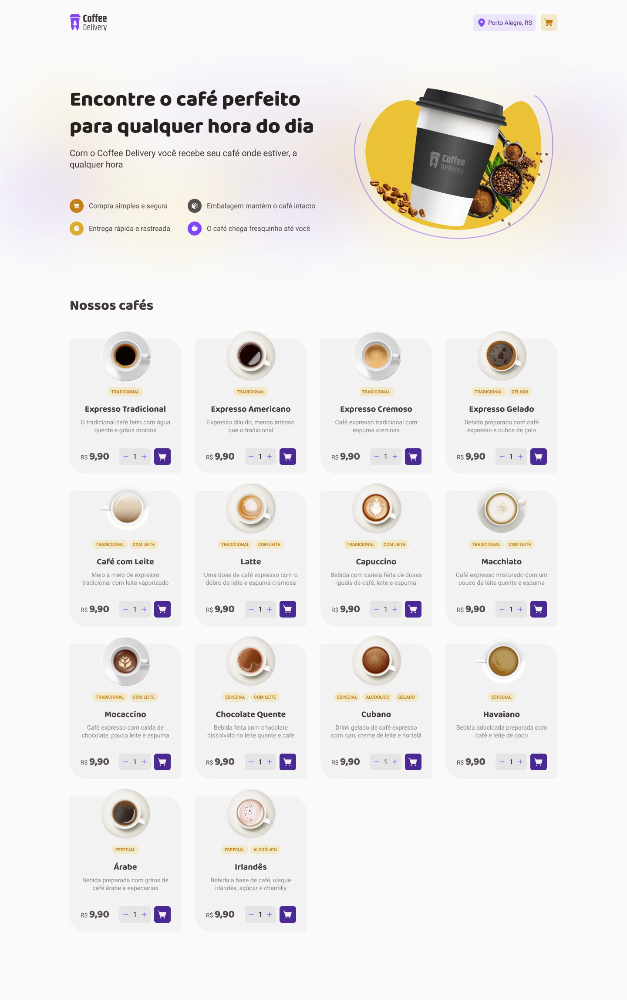

## IGNITE CHALLENGE - COFFEE DELIVERY

---

## Sobre 📝

Segundo aplicativo desenvolvido durante o programa Ignite da [RocketSeat](https://rocketseat.com.br/ignite)

---

## Layout 📐

  

    
  

---

## Ferramentas 🛠

- React.js
- Typescript
- Styled Components
- Vite

---

## Como usar 💻🚀

- Faça o download do projeto para o seu computador ou use o comando `git clone https://github.com/WagnerLeodoro/Coffee-Delivery.git`
- Abra a pasta Coffee-Delivery no seu terminal
- Rode o comando `npm install` para instalar o módulos do projeto
- Por fim, rode o comando `nmp run dev` para iniciar a aplicação.

# License 📕

Lançado em 2023 📕 License

This project is under the [MIT license](./LICENSE).
